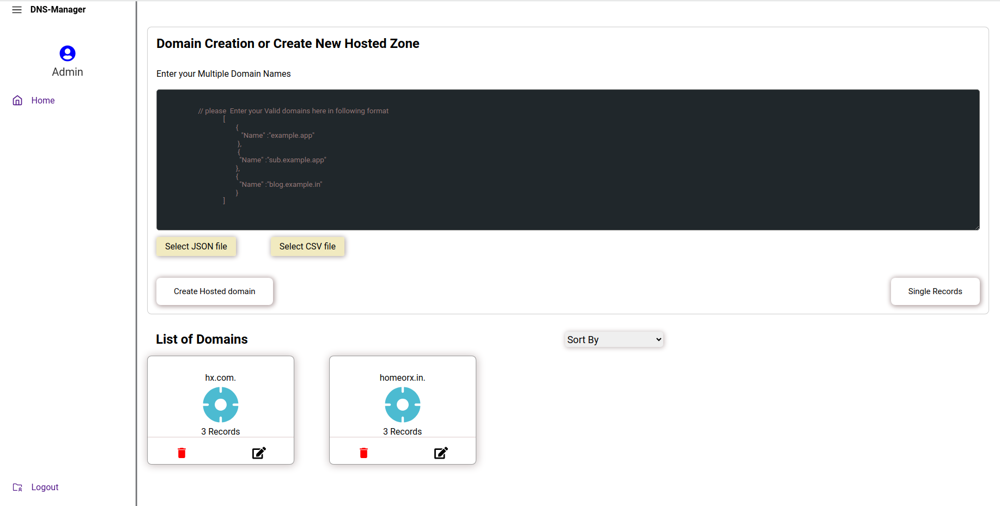
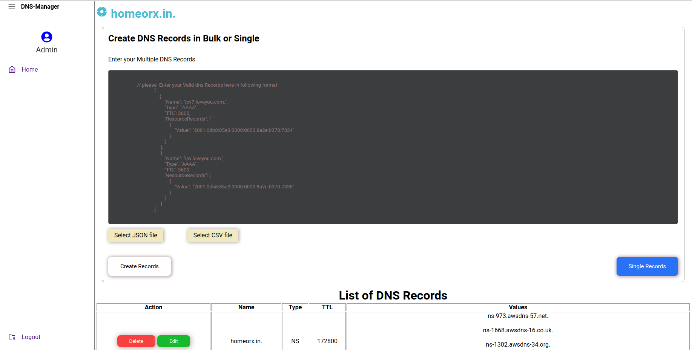
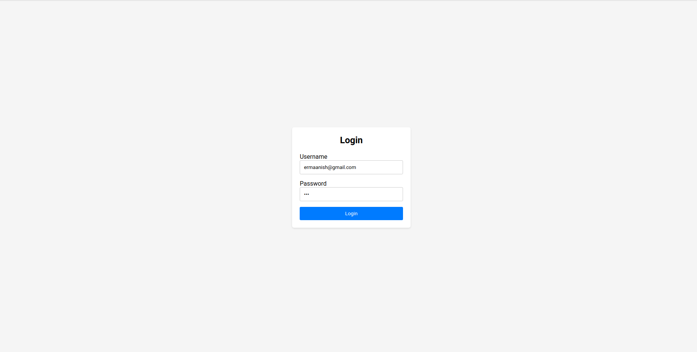

# Frontend


 

### React 


# Backend API


## Domain

## how to run this project  
### Run Backend
1. clone this project  
https://github.com/manish8285/dns-manager  
2. go to backend directory  and install by npm i 
3. make .env file and provide following creds  
a) PORT 
b) ACCESS_KEY_ID= [Your AWS KEY]  
c) SECRET_ACCESS_KEY= [Your AWS SECRET] 
d) HOSTED_ZONE_ID=[your zone like us-east-1]
e) MONGODB_URI=[Your DB connection string]
f) DB_NAME=dnsm 
g) JWT_SECRET=12345-67890-09876-54321 

4) Run this project by npm run dev  
5) Copy the backend url

### Run Frontend
2. go to frontend directory  and install by npm i  
3. make .env file and provide following creds  
a) VITE_API_URI= [Your backend url like 'https://dns-manager-peach.vercel.app/api/v1']
4) Run this project by npm run dev 
5) Get the url and go to browser in order to access this url 


GET
Hello world

```


```
---
GET
all domains
```
http://localhost:8181/api/v1/Domain/all
```

```
---

POST
create domain
```/domain/create```

Body
```
 [  
      {
        
        "Name": "forfronendtest.netlify.app"
      
    }
 ]
 ```
 
 
 
 POST
Delete

```/domain/delete```

Body

```
  [ 
    {
        "Name":"loveyou.com"
    },
    {
        "Name": "domain30.com"
    },
    {
        "Name": "domain31.com"
    }
  ]
```

## DNS records
GET all

```
http://localhost:8181/api/v1/dns-records/all?HostedZoneId=Z05995882B14FLLSY3QI7
```


```


POST
create
```
/dns-records/create-multi

 {
    "Name": "ipv7.loveyou.com.",
    "Type": "AAAA",
    "TTL": 3600,
    "ResourceRecords": [
        {
            "Value": "2001:0db8:85a3:0000:0000:8a2e:0370:7334"
        }
    ]
 }

```

POST
Delete Record
```
http://localhost:8181/api/v1/dns-records/delete/?HostedZoneId=Z05995882B14FLLSY3QI7
```

```

[{
            "Name": "sub.homeorx.in.",
            "Type": "A",
            "TTL": 300,
            "ResourceRecords": [
                {
                    "Value": "142.250.193.78"
                }
            ]
  
```

```
PUT
Update Record

http://localhost:8181/api/v1/dns-records/update/?HostedZoneId=Z05995882B14FLLSY3QI7

Body

[{
            "Name": "blog.homeorx.in.",
            "Type": "A",
            "TTL": 7200,
            "ResourceRecords": [
                {
                    "Value": "192.0.0.2"
                }
            ]


```

